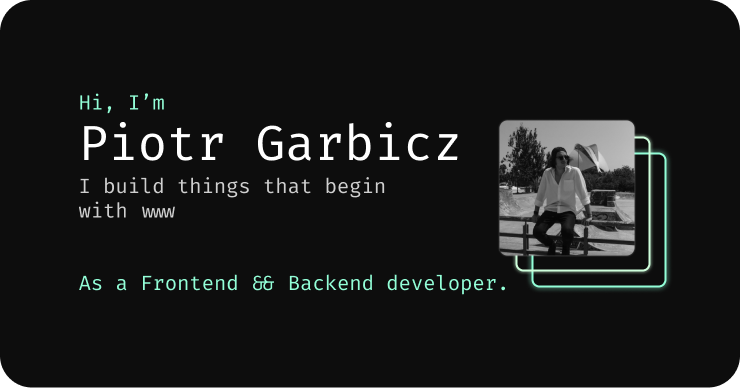

<h1 align="center">
  piotrgarbicz.dev
</h1>

<p align="center">
  Personal portfolio - <a href="https://piotrgarbicz.dev" target="_blank">piotrgarbicz.dev</a>.<br>Built with <a href="https://nuxt.com/" target="_blank">Nuxt</a>.
</p>

<p align="center">
  
</p>

## 🛠 Installation

1. Install dependencies

  ```sh
  yarn install
  ```

## 🚀 Development

1. Start dev server

  ```sh
  yarn dev
  ```

## 🚀 Generating static website

1. Generate a full static production build

  ```sh
  yarn build
  ```

2. Preview of the build

  ```sh
  yarn preview
  ```
